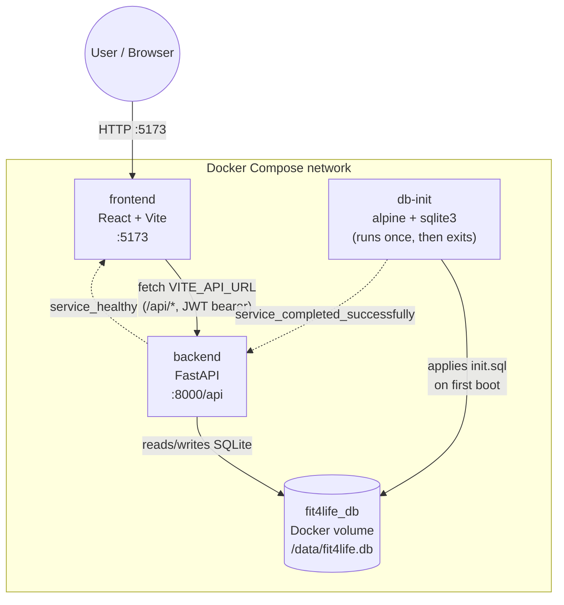
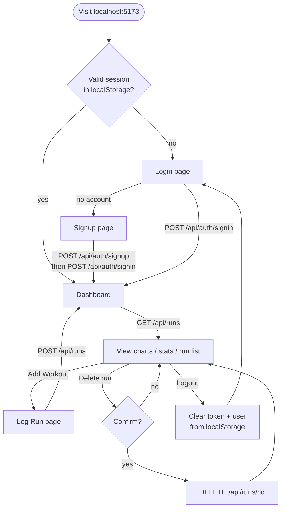
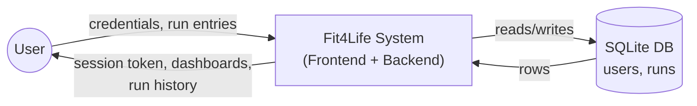
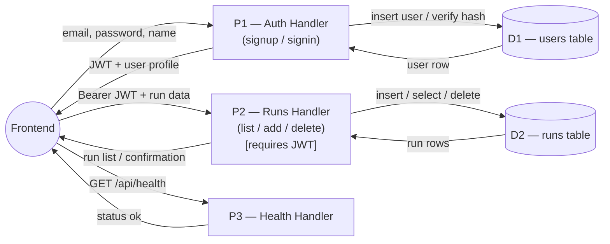
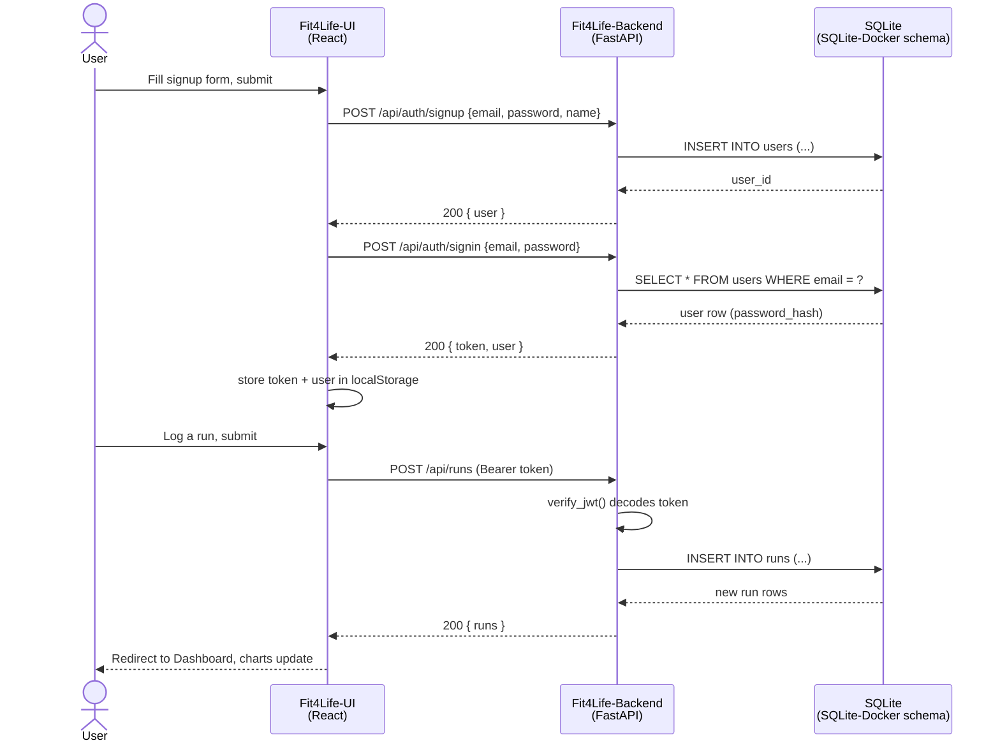

# Fit4Life — System Diagrams

Project-wide architecture, user flows, and data-flow diagrams (DFDs) for
Fit4Life, a fitness tracker. This is the top-level view; each component
has its own, more detailed `DIAGRAMS.md`:

- [Fit4Life-Backend/DIAGRAMS.md](Fit4Life-Backend/DIAGRAMS.md) — FastAPI service
- [Fit4Life-UI/DIAGRAMS.md](Fit4Life-UI/DIAGRAMS.md) — React/Vite frontend
- [SQLite-Docker/DIAGRAMS.md](SQLite-Docker/DIAGRAMS.md) — schema & DB bootstrap

## 1. System context

Three Docker services share one named volume. `db-init` is a one-shot
container that seeds/repairs the SQLite file before `backend` is allowed
to start; `frontend` waits until `backend` is healthy.

## 2. End-to-end user flow

The full journey across frontend and backend, from first visit to
logging a run.

## 3. Data flow diagram — Level 0 (context)

## 4. Data flow diagram — Level 1

Breaks the backend into its three functional processes and shows the
frontend as the sole external entity driving them.

## 5. How the pieces relate (cross-component sequence)

A single "sign up, then log a run" journey traced across all three
components, to show how the component-level docs connect.

## See also

- [Fit4Life-Backend/DIAGRAMS.md](Fit4Life-Backend/DIAGRAMS.md) — endpoint/script/DB internals, auth sequence detail
- [Fit4Life-UI/DIAGRAMS.md](Fit4Life-UI/DIAGRAMS.md) — routing, protected routes, component-level flows
- [SQLite-Docker/DIAGRAMS.md](SQLite-Docker/DIAGRAMS.md) — schema ER diagram, `db-init` bootstrap logic
