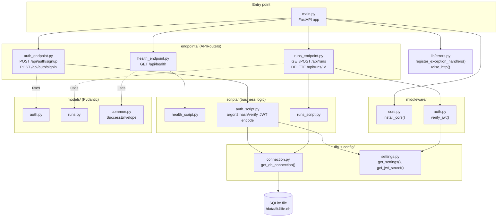
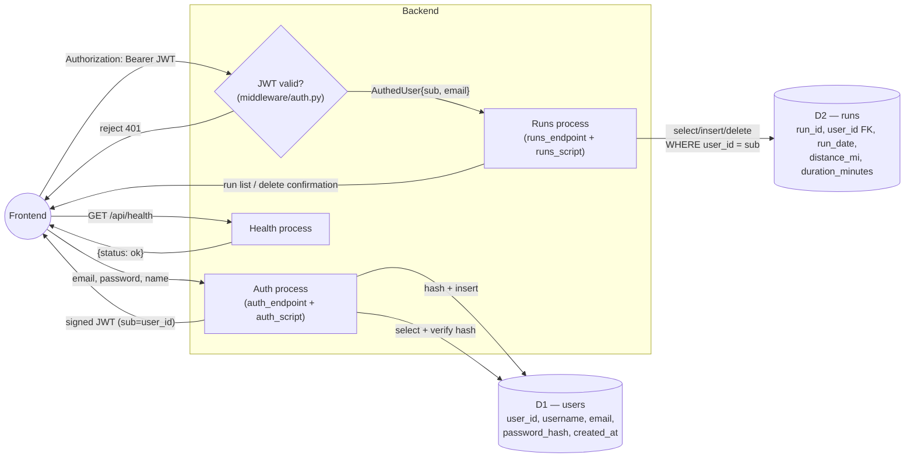
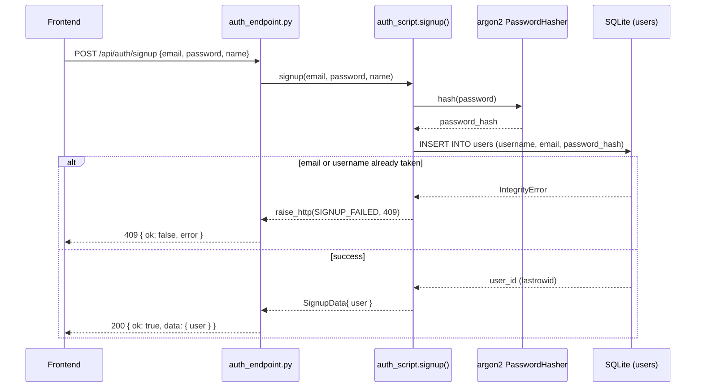
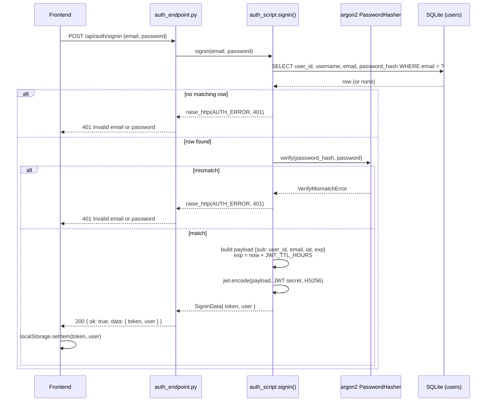
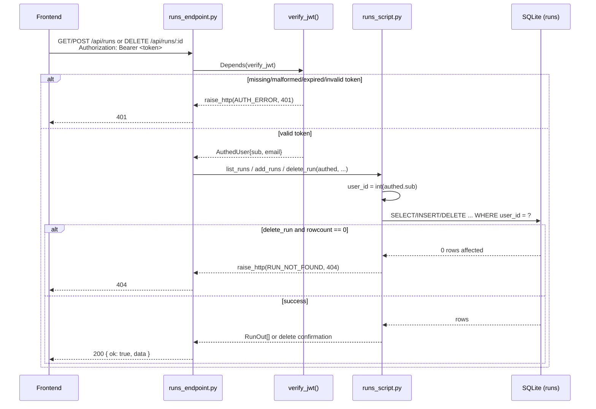
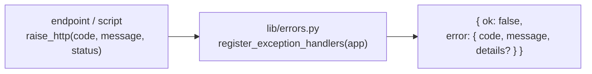

# Fit4Life-Backend — Diagrams

Component-level diagrams for the FastAPI service. For how this service
fits into the whole system, see [../DIAGRAMS.md](../DIAGRAMS.md). For
the frontend that calls this API, see
[../Fit4Life-UI/DIAGRAMS.md](../Fit4Life-UI/DIAGRAMS.md). For the
schema this service reads/writes, see
[../SQLite-Docker/DIAGRAMS.md](../SQLite-Docker/DIAGRAMS.md).

## 1. Component diagram

## 2. Data flow diagram (backend-internal)

## 3. Sequence — signup

## 4. Sequence — signin (JWT issuance)

## 5. Sequence — authenticated `/api/runs` request

Applies to `GET /api/runs`, `POST /api/runs`, and
`DELETE /api/runs/:run_id`; all go through the same JWT check before
reaching `runs_script`.

## 6. Error handling

All handlers funnel unexpected/known errors through a single exception
path so the frontend always sees the same envelope shape.

