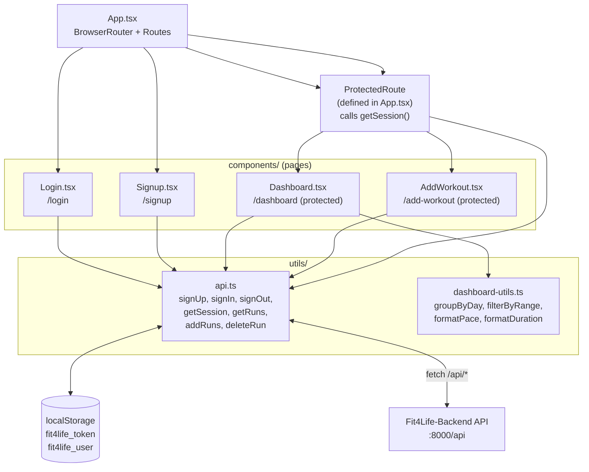
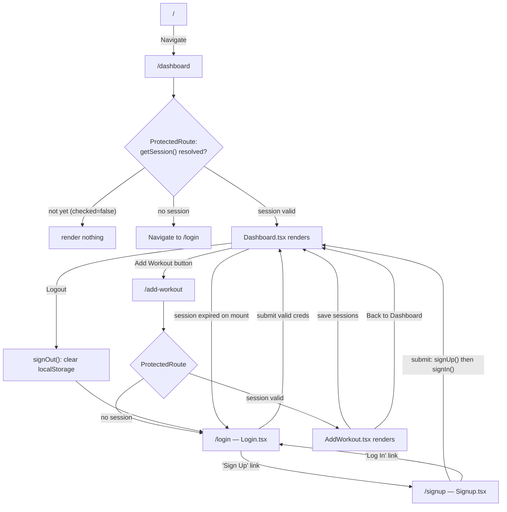
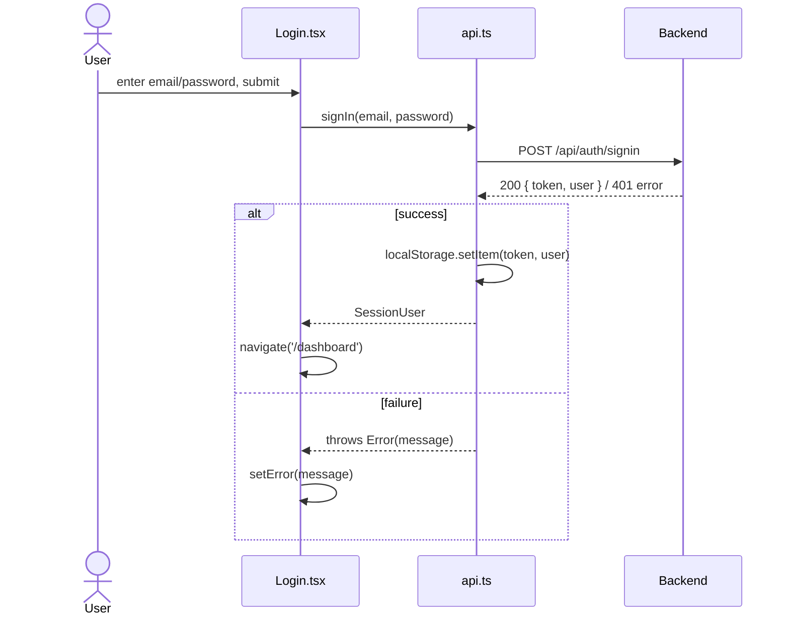
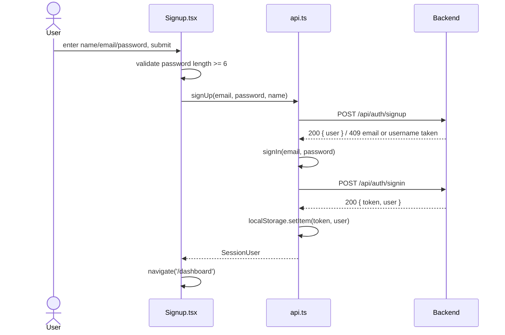
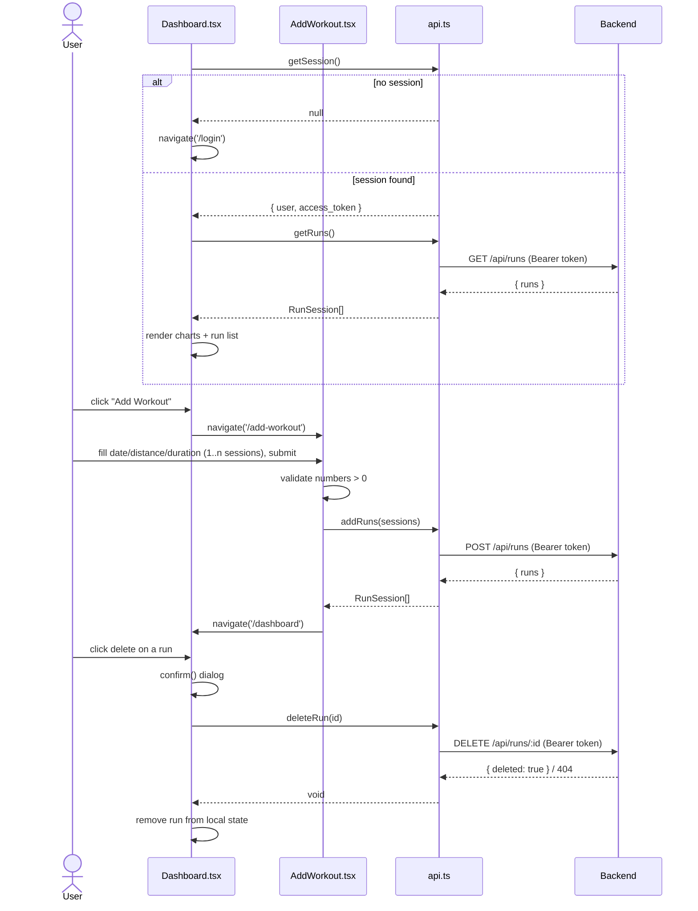
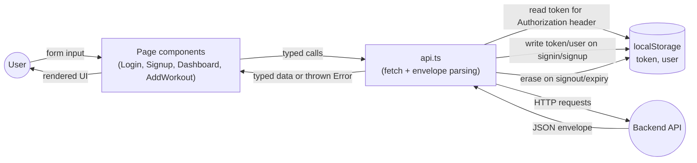

# Fit4Life-UI — Diagrams

Component-level diagrams for the React/Vite frontend. For how this
fits into the whole system, see [../DIAGRAMS.md](../DIAGRAMS.md). For
the API this frontend calls, see
[../Fit4Life-Backend/DIAGRAMS.md](../Fit4Life-Backend/DIAGRAMS.md).

## 1. Component diagram

## 2. Routing / user flow

Mirrors the actual routing logic in `App.tsx`: unauthenticated users are
bounced to `/login`; `/` always redirects to `/dashboard` (which then
redirects to `/login` if there's no session).

## 3. Sequence — login

## 4. Sequence — signup

Signup immediately chains into signin so the user lands in an
authenticated session without a second manual login.

## 5. Sequence — dashboard load, add workout, delete run

## 6. Data flow diagram (frontend-internal)

