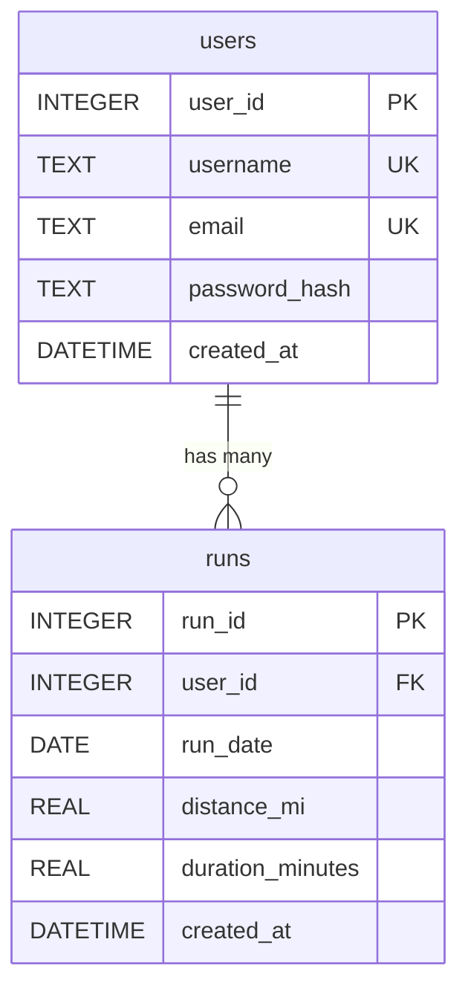
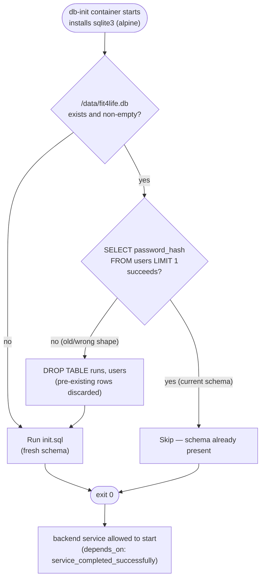
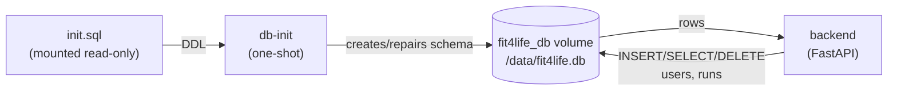

# SQLite-Docker — Diagrams

Schema and bootstrap diagrams for the database layer. For how this fits
into the whole system, see [../DIAGRAMS.md](../DIAGRAMS.md). For the
service that reads/writes this schema, see
[../Fit4Life-Backend/DIAGRAMS.md](../Fit4Life-Backend/DIAGRAMS.md).

## 1. Entity relationship diagram

From [`init.sql`](init.sql).

`runs.user_id` has `ON DELETE CASCADE`; deleting a user removes their
runs. `idx_runs_user_date` indexes `runs(user_id, run_date)` for the
dashboard's per-user, date-ordered queries.

## 2. `db-init` bootstrap flow

The `db-init` service (`docker-compose.yml`) runs once before `backend`
is allowed to start, and decides how to (re)initialize the shared
volume.

## 3. Data flow diagram

## Factory reset

`docker compose down -v` deletes the named volume; the next
`docker compose up -d` recreates it and `db-init` reapplies
[`init.sql`](init.sql) from scratch.
